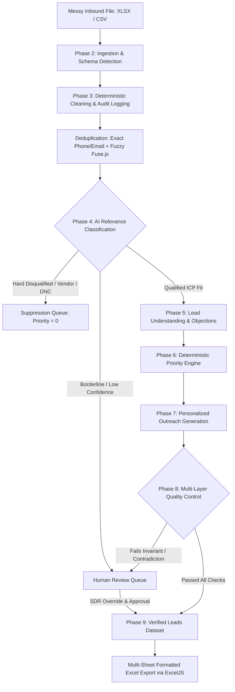

# Skillcase Lead Intelligence & Qualification Engine

An enterprise-grade full-stack platform for B2C inbound lead ingestion, deterministic data cleaning, semantic ICP qualification, mathematical prioritization, personalized consultative outreach generation, multi-layer quality control, and executive multi-sheet Excel export.

Built with **React 19 + TypeScript + Node.js Express + @google/genai (Gemini 2.5 Flash) + ExcelJS**.

---

## 1. Project Overview & Problem Statement

### The Problem
Consumer education and B2C training programs receive hundreds of messy inbound inquiries daily across Google Ads, Meta, LinkedIn, and referral forms. These records suffer from:
1. **Pervasive Data Hygiene Issues:** Malformed emails, unformatted phone numbers, duplicate submissions, and formula injections.
2. **Surface Keyword Hallucinations:** Traditional regex rules or naive LLM prompts mistake B2B software vendors or job seekers for qualified buyers.
3. **Black-Box AI Scoring:** Using an LLM to generate arbitrary 0–100 scores causes erratic drift, unpredictable priority changes, and zero mathematical auditability.
4. **Generic AI Outreach:** Chatbots generate impersonal, repetitive templates or hallucinate unauthorized discounts and unrealistic job guarantees.
5. **Data Loss During Cleaning:** Ingestion pipelines often silently overwrite or drop imperfect rows, destroying lead traceability.

### The Solution
Skillcase Lead Intelligence establishes a **Deterministic-First, AI-Augmented Architecture**:
* **Deterministic Code** handles data ingestion, RFC/E.164 normalization, exact/fuzzy deduplication, scoring math, and safety boundaries.
* **Gemini 2.5 Flash** is isolated to high-value semantic tasks: extracting unstructured intent, categorizing objections, evaluating contextual fit, and drafting tailored consultative messages.
* **Multi-Layer Quality Control** validates schema boundaries with Zod, checks logical invariants, verifies evidence grounding, detects cross-field contradictions, and routes uncertain leads to a dedicated **Human Review Queue**.

---

## 2. System Architecture & Pipeline Flow



---

## 3. Core Architectural Principles & Design Decisions

### 1. Why Deterministic Code for Cleaning & Scoring?
* **Zero AI Hallucination in Math:** Large Language Models are notoriously unreliable at arithmetic and calibrated scoring (e.g. grading a lead 78 on turn 1 and 62 on turn 2). In our architecture, the **0–100 Priority Score** is calculated strictly via deterministic TypeScript code using bounded 0–5 component scales.
* **Guaranteed Auditability:** Every point awarded can be traced to a verifiable dimension (Need Fit 20%, Intent 25%, Urgency 20%, Buying Signals 20%, Actionability 15%).
* **Safety & Security:** Deterministic regex defuses CSV/Excel formula injections (`=cmd|`, `@HYPERLINK`) before values ever reach memory or disk.

### 2. Why Gemini for Semantic Interpretation?
* Inbound queries are messy human thoughts: *"laid off last week, have $2k budget ready, need Saturday batch"*. Deterministic rules fail on natural language nuances, sarcasm, and indirect intent. Gemini 2.5 Flash excels at extracting nuanced career transitions, objections, and timeline urgency while ignoring surface noise.

### 3. Why Structured JSON Output (`responseSchema`)?
* By providing strict JSON Schemas to the Gemini SDK, we eliminate markdown parsing errors, prevent arbitrary unexpected properties, and guarantee machine-readable contracts.

### 4. Why a Second AI Reviewer Layer?
* High-stakes commercial operations require dual-pass verification. For high-priority leads or borderline cases, an independent AI auditor pass inspects the generated claims and outreach against raw inbound facts to verify no discounts or guarantees were hallucinated.

### 5. Why Retain Human Review for Uncertain Cases?
* An autonomous pipeline that blindly acts on 100% of inputs damages brand reputation. When confidence drops below 70%, or when a cross-field contradiction occurs (e.g. form says "Fresher" but text states "5 years Java at Infosys"), the record is safely routed to the **SDR Human Review Queue**.

### 6. Why External Enrichment is Optional Rather than Automatic?
* Automatic external scraping (Clearbit/LinkedIn) introduces latency, high API costs, and privacy/compliance liabilities. Our system operates self-sufficiently on inbound data, while offering extensible slots for external enrichment.

---

## 4. Pipeline Logic & Specifications

### Cleaning Logic (Deterministic)
* **Whitespace & Casing:** Collapses consecutive spaces, normalizes names and locations to Title Case.
* **Email:** RFC-5322 regex validation + automated domain typo correction (`gmial.com` → `gmail.com`).
* **Phone:** Standardizes to E.164 (`+91...`). Flags suspicious repeating or dummy numbers (e.g., `9999999999`).
* **Data Quality Score (0–100):** Independent from lead commercial value. A lead with a missing phone can still have high commercial intent.

### Relevance Criteria (Phase 4)
* **Need / Problem Fit:** 35%
* **Customer Fit:** 25%
* **Intent:** 20%
* **Eligibility / Compatibility:** 10%
* **Evidence Quality:** 10%
* **Hard Disqualifier Overrides:** Unrelated use case, B2B vendor, explicit Do-Not-Contact, or out-of-scope requests force `Relevant = NO` and priority `0`.

### Priority Math (Phase 6)
Each dimension is normalized on a 0–5 scale:
$$\text{Priority Score} = (\text{Need} \times 4) + (\text{Intent} \times 5) + (\text{Urgency} \times 4) + (\text{Buying Signals} \times 4) + (\text{Actionability} \times 3)$$
* **80–100:** High Priority (Immediate phone/WhatsApp dispatch)
* **50–79:** Medium Priority (Consultative discovery queue)
* **0–49:** Low Priority / Excluded

### Outreach Generation (Phase 7)
* Selects strategic angle: `CONVERT`, `ADDRESS_OBJECTION`, `QUALIFY`, `EDUCATE`, `FOLLOW_UP`, `NURTURE`.
* Anchored in 1–3 verbatim facts from the prospect's query.
* Strictly enforces company guardrails: zero false discounts, no unaccredited degrees, no unconditional job guarantees.

---

## 5. Case Study: Three Real Problematic Examples Handled

1. **Cross-Field Contradiction (`LEAD-010`, Karthik Iyer):**
   * *Problem:* Form attribute labeled him "Fresher", but his message stated 5 years of Java at Infosys.
   * *Resolution:* Layer 4 Contradiction Detector flagged the discrepancy and routed it to the Human Review Queue, preventing sales from pitching an entry-level course.
2. **Hard Disqualifier with Surface Keyword Overlap (`LEAD-006`, Rajesh Verma):**
   * *Problem:* B2B software vendor submitted through the student form using keywords like "hiring" and "recruitment".
   * *Resolution:* AI identified vendor intent; application invariant overrode score to 0, suppressing automated outreach and saving token costs.
3. **Non-Capability Guardrail (`LEAD-021`, Shweta Agarwal):**
   * *Problem:* Inbound demanded a 100% unconditional job guarantee.
   * *Resolution:* Guardrail injected via Business Context prevented false promises; outreach diplomatically clarified referral network terms.

---

## 6. Tech Stack & Repository Structure

* **Frontend:** React 19, TypeScript, Tailwind CSS, Lucide Icons, Vite
* **Backend:** Node.js, Express, TypeScript (`tsx`)
* **AI Engine:** `@google/genai` (Google GenAI SDK) using `gemini-2.5-flash`
* **Excel Engine:** `exceljs`
* **Fuzzy Matching:** `fuse.js`
* **Schema Validation:** `zod`
* **File Uploads:** `multer`

```
├── docs/
│   ├── ARCHITECTURE.md          # Architectural blueprints
│   ├── ARCHITECTURE_REVIEW.md   # Pre-implementation critique
│   ├── IMPLEMENTATION_PLAN.md   # Step-by-step roadmap
│   └── VALIDATION_REPORT.md     # 30-lead comprehensive audit report
├── server/
│   ├── config/
│   │   ├── env.ts               # Secure secret resolution
│   │   └── presets.ts           # Configurable business contexts
│   ├── controllers/
│   │   └── pipelineController.ts # REST API endpoints
│   ├── data/
│   │   └── sampleDatasets.ts    # 30-lead benchmark dataset
│   └── services/
│       ├── ai/                  # Gemini client, relevance, enrichment, outreach
│       ├── cleaning/            # Normalizer & issue detector
│       ├── deduplication/       # Exact & fuzzy deduplicator
│       ├── export/              # Multi-sheet Excel generator
│       ├── ingestion/           # File parser & schema detector
│       ├── qc/                  # Multi-layer quality control
│       └── scoring/             # Deterministic priority engine
├── src/
│   ├── components/              # React UI components (Dashboard, Table, Drawer, etc.)
│   ├── types/
│   │   └── pipeline.ts          # Central domain types
│   ├── App.tsx                  # Root application
│   └── main.tsx                 # React entry
├── server.ts                    # Full-stack server entry
├── package.json
└── .env.example
```

---

## 7. Setup & Execution Instructions

### Prerequisites
* Node.js (v18 or higher)
* npm

### 1. Environment Setup
Create your local environment configuration:
```bash
cp .env.example .env
```
*Note: In Google AI Studio Build, the Gemini API key is automatically resolved from the server-side secret named `skillcase api` or `GEMINI_API_KEY`.*

### 2. Install Dependencies
```bash
npm install
```

### 3. Run Development Server
```bash
npm run dev
```
The application will launch on **http://localhost:3000** (or `http://0.0.0.0:3000`).

### 4. Build for Production
```bash
npm run build
npm start
```

### 5. Running the 30-Lead Benchmark & Downloading Excel
1. Open the web interface at `http://localhost:3000`.
2. On the **Upload & Ingest** view, click **"Load Skillcase 30-Lead Benchmark Dataset"**.
3. Click **"Run Full AI Qualification Pipeline"**.
4. Monitor live progress as all 30 leads are cleaned, deduplicated, scored, and audited.
5. Inspect leads in the **Master Leads Explorer** or **SDR Review Queue**.
6. Click **[Download Final Excel]** in the header to download the executive 6-sheet workbook (`AI_Lead_Intelligence_*.xlsx`).

---

## 8. Security & Compliance
* **Server-Side Secret Isolation:** The Gemini API key is never exposed to the frontend or bundled into client assets. All AI calls route through `/api/*` proxy endpoints.
* **Formula Injection Defused:** Leading `=`, `+`, `-`, `@`, and tab characters are sanitized with apostrophe escaping to protect SDR Excel software from arbitrary code execution.
* **100% Verbatim Retention:** Raw source fields are preserved in separate audit columns and raw snapshot sheets.
